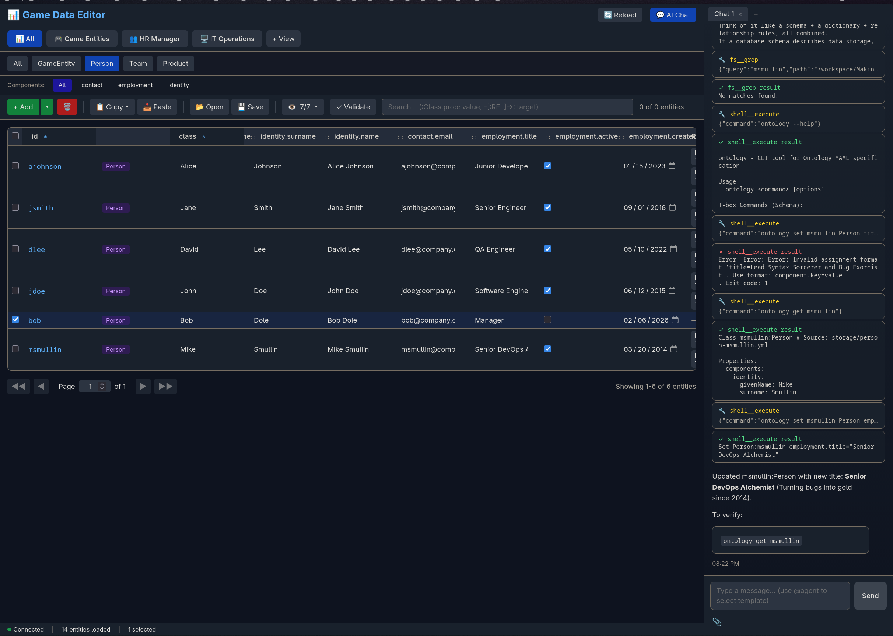

# Data Editor (gdedit)

A browser-based, spreadsheet-style editor for managing ECS [ontology](https://github.com/mikesmullin/ontology/) YAML data store. 

Uses [subd](https://github.com/mikesmullin/ontology/) for the AI Agent.

## Screenshot



## Features

- 📊 Spreadsheet-style UI for editing entities
- 🤖 Agentic AI chat assistant
- 🏷️ Activity views (role-based filtering)
- 📑 Class/type tabs for organization
- 🔍 Search/filter with query syntax
- ✏️ Inline cell editing
- 📄 Pagination for large datasets
- 💾 Auto-save to YAML files

## Requirements

- [Bun](https://bun.sh/) runtime

## Installation

```bash
bun install
```

## Configuration

Edit `config.yaml` to configure the storage path:

```yaml
storage:
  path: "/workspace/ontology/storage"  # Path to ontology YAML files

server:
  port: 3000
  host: "localhost"

ui:
  pageSize: 20
  defaultView: "all"
```

## Running

```bash
# Development (with hot reload)
bun run dev

# Production
bun run start
```

Open http://localhost:3000 in your browser.


## API Endpoints

| Endpoint | Method | Description |
|----------|--------|-------------|
| `/api/schema` | GET | Get ontology schema |
| `/api/classes` | GET | List all classes |
| `/api/classes/:name/columns` | GET | Get columns for a class |
| `/api/instances` | GET | List all instances |
| `/api/instances?class=X` | GET | List instances of class |
| `/api/instances/:id` | GET | Get instance by ID |
| `/api/instances` | POST | Create new instance |
| `/api/instances/:id` | PUT | Update instance |
| `/api/instances/:id` | PATCH | Partial update |
| `/api/instances/:id` | DELETE | Delete instance |
| `/api/reload` | POST | Reload data from disk |

## Search Query Syntax

Uses [ontology](https://github.com/mikesmullin/ontology/) search syntax.