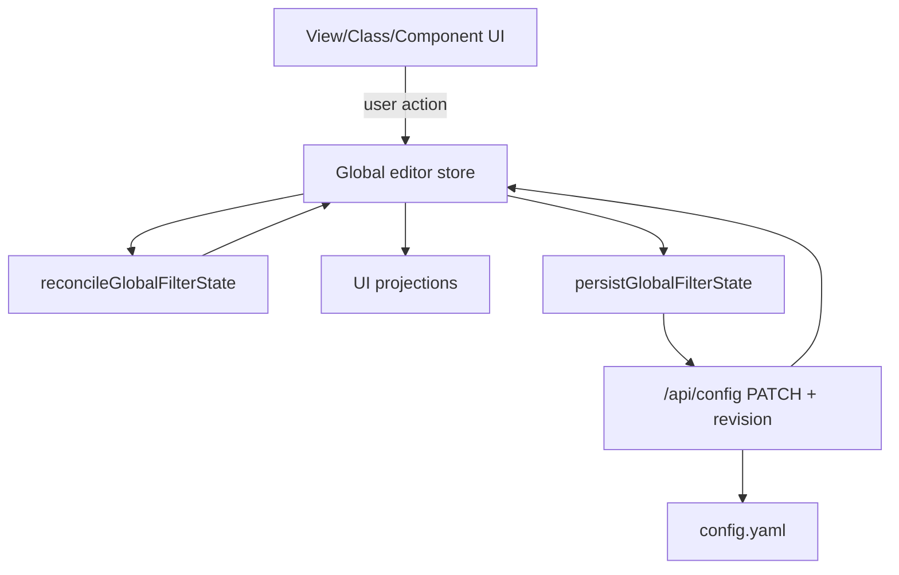
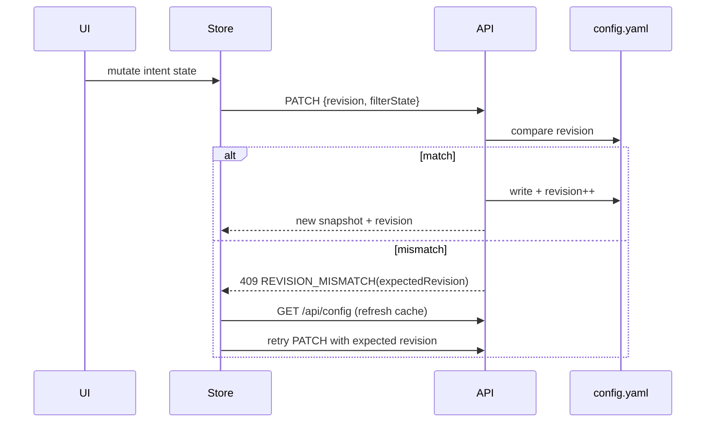
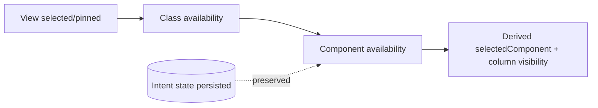

# Predictable State

This document captures the robust state-management patterns introduced to prevent race conditions in:

- persisting `config.yaml`
- reflecting correct state in UI tiers with constraints (such as `View -> Class -> Component` tiers)

The implementation is custom (inspired by React Redux, but not using any dependencies), but intentionally follows predictable unidirectional data flow principles.

---

## Goals

1. One authoritative app state in the SPA.
2. Deterministic constraint enforcement in one place.
3. Concurrency-safe persistence to `config.yaml`.
4. Avoid startup and watcher races that clear UI state.

---

## 1) Single Source of Truth (Global Store)

We moved tier state ownership to the global Alpine store (`editor`) so UI components project state instead of owning duplicate copies.

```js
Alpine.store('editor', {
  configSnapshot: null,
  configRevision: null,
  configLoaded: false,
  dataLoaded: false,
  selectedViews: [],
  pinnedViews: [],
  selectedClasses: [],
  pinnedClasses: [],
  selectedComponents: [],
  pinnedComponents: [],
  // ...
});
```

Reference: `public/js/app.js:19-49`

**Pattern to keep:**
- Tier components should not maintain separate selected/pinned copies.
- Store is authoritative; components are pure projections + action emitters.

---

## 2) Load Config Once, Cache Snapshot, Reuse Everywhere

`loadConfig()` now hydrates the store once with both data and metadata (`revision`). Tier components read from snapshot rather than fetching independently.

```js
store.configSnapshot = config;
store.configRevision = Number.isInteger(Number(config?.revision)) ? Number(config.revision) : 0;
store.configLoaded = true;

store.selectedViews = viewSelected;
store.pinnedViews = viewPinned;
store.selectedClasses = classSelected;
store.pinnedClasses = classPinned;
store.selectedComponents = componentSelected;
store.pinnedComponents = componentPinned;
```

Reference: `public/js/app.js:171-203`

**Pattern to keep:**
- Per-component startup fetches of `/api/config` are forbidden for tier state.
- Refresh the snapshot only on startup, explicit reload, or conflict-retry path.

---

## 3) Revision-Based Optimistic Concurrency for `config.yaml`

Server requires revision match for `PUT/PATCH /api/config` and `POST /api/views`.

```js
const bodyRevision = Number(body?.revision);
if (!Number.isInteger(bodyRevision)) {
  return errorResponse('Missing or invalid revision', 400, {
    code: 'REVISION_REQUIRED',
    expectedRevision: current.revision
  });
}
if (bodyRevision !== current.revision) {
  return errorResponse('Revision mismatch', 409, {
    code: 'REVISION_MISMATCH',
    expectedRevision: current.revision
  });
}
nextConfig.revision = current.revision + 1;
```

Reference: `src/lib/api.js:119-183`

**Pattern to keep:**
- Every mutation includes the expected revision.
- Server rejects stale writes.
- Successful writes increment revision exactly once.

---

## 4) Client Conflict Retry (No Lost Updates)

Client mutation helpers retry once on `REVISION_MISMATCH` by refreshing cache and resubmitting.

```js
const res = await fetch('/api/config', { method: 'PATCH', body: JSON.stringify(payload) });
if (res.ok) {
  const cfg = await res.json();
  updateConfigCache(cfg);
  return cfg;
}
const details = await res.json().catch(() => ({}));
if (res.status === 409 && details?.code === 'REVISION_MISMATCH') {
  store.configRevision = details.expectedRevision;
  // retry loop continues
}
```

Reference: `public/js/components/tabs.js:129-171`

Related view-save helper:
Reference: `public/js/components/tabs.js:174-210`

**Pattern to keep:**
- Mutation utilities own retry behavior.
- UI handlers dispatch intent only; they do not reimplement conflict logic.

---

## 5) One Global Reconcile Function for Cross-Tier Constraints

All constraints are enforced in one function:

- normalize selected/pinned by current availability
- compute derived active selections (`currentView`, `selectedClass`, `selectedComponent`)
- apply component column visibility

```js
function reconcileGlobalFilterState() {
  // 1) View-level normalize
  // 2) Class-level normalize based on selected views
  // 3) Component-level effective behavior based on selected classes
}
```

Reference: `public/js/components/tabs.js:297-353`

**Pattern to keep:**
- Never spread constraint logic across tier components.
- Every relevant mutation eventually funnels through this reconcile.

---

## 6) Intent State vs Derived Availability State

Critical fix for Component race:

- `selectedComponents`/`pinnedComponents` are **intent** (persisted user choice)
- temporary availability changes do not destructively erase intent
- derived/effective selection drives immediate rendering and visibility

```js
const compState = orderedVisibleNames(
  store.selectedComponents || [],
  store.pinnedComponents || [],
  availableComponents
);

// Do not prune component intent arrays here.
setValueIfChanged(store, 'selectedComponent', compState.selectedValid.length ? compState.selectedValid[0] : null);
applyComponentColumnVisibility(compState.selectedValid);
```

Reference: `public/js/components/tabs.js:331-345`

**Pattern to keep:**
- Persist intent; derive display/effective state.
- Avoid destructive writes from transient availability.

---

## 7) Idempotent Reconcile to Avoid Reactive Loops

Reconcile updates store only when values actually changed.

```js
function setArrayIfChanged(store, key, next) {
  const prev = Array.isArray(store[key]) ? store[key] : [];
  if (arraysEqualShallow(prev, next)) return false;
  store[key] = [...next];
  return true;
}
```

Reference: `public/js/components/tabs.js:253-269`

**Pattern to keep:**
- Any watcher-triggered reconcile must be idempotent.
- Do not reassign arrays/values with equivalent content.

---

## 8) User-Driven Persistence Only

Tier interactions persist through one global call:

```js
void persistGlobalFilterState();
```

Reference: `public/js/components/tabs.js:355-370`

**Pattern to keep:**
- Avoid writing during pure startup reconciliation unless intentional.
- Persist on user actions (toggle/add/pin) and explicit save flows.

---

## 9) Tier Components as Thin Projections

Tier modules (`viewFilter`, `classTypeFilter`, `componentTypeFilter`) now:

- read from global store
- call global reconcile
- call global persist for user actions

References:
- `public/js/components/tabs.js:376-560` (`viewFilter`)
- `public/js/components/tabs.js:565-849` (`componentTypeFilter`)
- `public/js/components/tabs.js:852-1038` (`classTypeFilter`)

**Pattern to keep:**
- No local duplicated selected/pinned source.
- No per-tier config fetch ownership.

---

## Architecture Diagrams

### A) State + Reconcile + Persistence



### B) Optimistic Concurrency Path



### C) Constraint Cascade



---

## Practical Rules for Future Changes

1. **Add state in store first**, not in tier-local component object.
2. **Add constraints in `reconcileGlobalFilterState()` only**.
3. **Use idempotent updates** (`setArrayIfChanged`, `setValueIfChanged`).
4. **Treat persisted arrays as intent**; derive effective selections from availability.
5. **Persist through central helper** (`persistGlobalFilterState`) with revision checks.
6. **Handle conflicts by refresh+retry**, never by blind overwrite.
7. **When adding watchers, verify no write loop**: watcher -> reconcile -> unchanged -> no assignment.
8. **On startup, gate destructive normalization by readiness** (`configLoaded`, `dataLoaded`).

---

## Files You’ll Most Likely Touch

- `public/js/app.js` (global store + snapshot hydration)
- `public/js/components/tabs.js` (tier actions, reconcile, persistence)
- `src/lib/api.js` (revision enforcement + config normalization)
- `config.yaml` (persisted app state + `revision`)

---

## Summary

The robust fix was not one patch; it was a set of invariants:

- one source of truth
- one constraint engine
- one persistence path with optimistic concurrency
- idempotent reconciliation
- intent preserved from transient availability

Following these invariants is what makes this architecture predictable and race-resistant without adding external state libraries.
